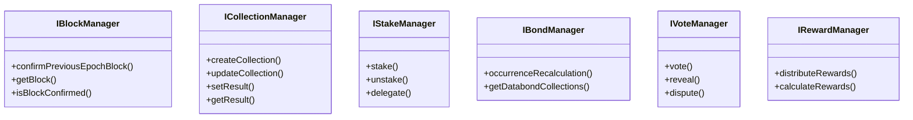

# System Architecture

## Overview

The Oracle Contracts system is a decentralized oracle network that enables reliable off-chain data reporting and aggregation on blockchain networks. The system uses a sophisticated architecture of smart contracts to manage data collection, stake-based validation, and reward distribution.

## Core Components

### 1. Collection Management System
The Collection Manager is the primary interface for data management:
- **Jobs**: Individual data sources with specific URLs and parsing instructions
- **Collections**: Groups of related jobs with defined aggregation methods
- **Results**: Aggregated and validated data points

### 2. Stake Management System
Manages staker participation and security:
- Stake allocation and tracking
- Slashing conditions
- Delegation mechanisms

### 3. Block Management System
Handles the epoch-based progression of the oracle:
- Block confirmation process
- Epoch transitions
- Result finalization

### 4. Vote Management System
Coordinates the consensus process:
- Vote collection and tracking
- Dispute resolution
- Result finalization

### 5. Bond Management System
Handles data bond management:
- Collection assignments
- Bond calculations
- Occurrence tracking

### 6. Reward Management System
Manages incentive distribution:
- Block rewards
- Staking rewards
- Penalty management

## Data Flow

## Security Model

The system employs multiple security mechanisms:

1. **Staking**: Participants must stake tokens to participate
2. **Consensus**: Multi-stage validation process
3. **Slashing**: Penalties for malicious behavior
4. **Bonding**: Collection-specific security deposits

## Network States

The oracle network operates in distinct states:

## Smart Contract Architecture

## Deployment Architecture

The system supports deployment across multiple networks:

## Integration Points

### External Interfaces
1. **Client Integration**
   - Direct contract calls
   - Event monitoring
   - Result verification

2. **Data Source Integration**
   - URL-based data fetching
   - Multiple selector types (JSON/XHTML)
   - Custom aggregation methods

### Internal Communication
1. **Inter-Contract Communication**
   - Strict access control
   - State synchronization
   - Event-based updates

## Scalability Considerations

The system is designed with several scalability features:

1. **Horizontal Scaling**
   - Multiple collections can be processed in parallel
   - Independent staker operations
   - Distributed data sourcing

2. **Vertical Scaling**
   - Configurable epoch lengths
   - Adjustable collection parameters
   - Flexible aggregation methods

## Future Architecture Considerations

1. **Planned Improvements**
   - Layer 2 integration
   - Cross-chain communication
   - Enhanced data verification methods

2. **Expansion Areas**
   - Additional data source types
   - New consensus mechanisms
   - Advanced reward systems

## Related Documentation
- [Setup and Installation](setup-and-installation.md)
- [API Reference](api-reference.md)
- [Data Models](data-models.md)
- [Core Concepts](core-concepts.md)