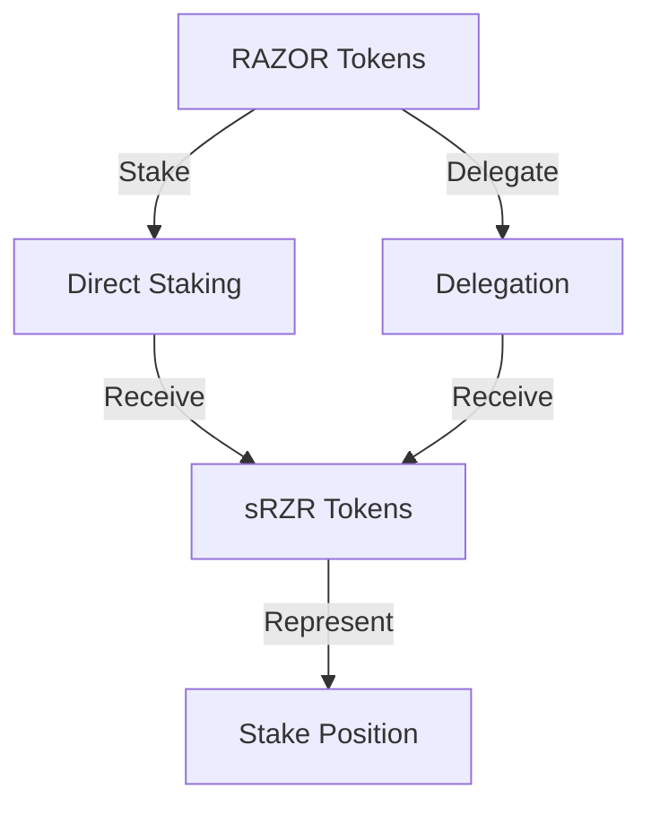
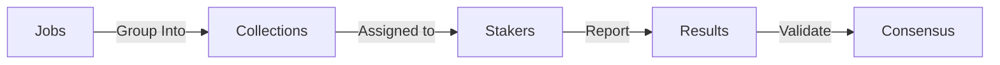
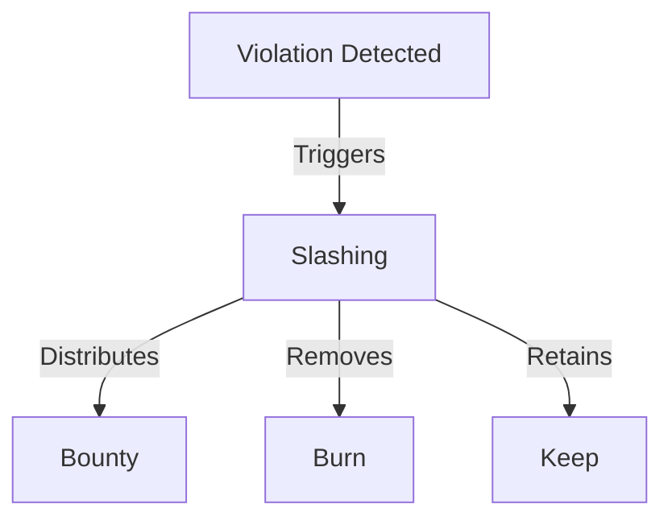
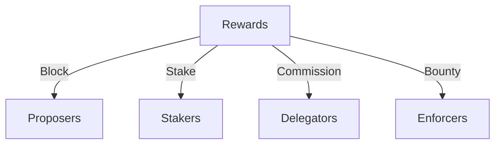
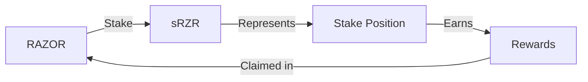

# Core Concepts

This document explains the fundamental concepts and terminology used in the Oracle Contracts system.

## Staking System

### Staking and Delegation
The system uses a Proof of Stake (PoS) consensus mechanism where participants can:

1. **Direct Staking**
   - Participants can stake RAZOR tokens directly
   - Minimum safe amount required for staking
   - Stakers receive sRZR (Staked RAZOR) tokens representing their stake
   - Stakers can run nodes and participate in oracle operations

2. **Delegation**
   - Users can delegate their RAZOR tokens to existing stakers
   - Delegators receive sRZR tokens proportional to their delegation
   - Stakers can set commission rates for delegation
   - Helps achieve decentralization without requiring everyone to run nodes



### Stake Management
The system includes sophisticated stake management features:

1. **Staking Operations**
   - Stake: Lock RAZOR tokens and receive sRZR
   - Unstake: Lock sRZR tokens for withdrawal
   - Withdraw: Claim unstaked RAZOR tokens
   - Lock periods for security

2. **Maturity and Influence**
   - Stakers gain maturity over time
   - Influence = Maturity × Stake
   - Higher influence means more weight in consensus

## Oracle Operations

### Data Collection System

1. **Jobs**
   - Individual data sources
   - Specific URLs and parsing instructions
   - Power (decimal adjustment) settings
   - Weight in aggregation

2. **Collections**
   - Groups of related jobs
   - Aggregation methods
   - Tolerance levels for deviation
   - Update frequency (occurrence)



### Consensus Mechanism

The system operates in epochs with distinct states:

1. **Epoch States**
   ```mermaid
   stateDiagram-v2
       [*] --> Commit
       Commit --> Reveal
       Reveal --> Propose
       Propose --> Confirm
       Confirm --> [*]
   ```

2. **State Functions**
   - Commit: Submit hashed values
   - Reveal: Reveal actual values
   - Propose: Select block proposer
   - Confirm: Finalize results

## Security Model

### Slashing Conditions
The system enforces security through penalties:

1. **Slashing Components**
   - Bounty: Reward for identifying violations
   - Burn: Tokens removed from circulation
   - Keep: Tokens retained by the system

2. **Penalty Triggers**
   - Invalid data reporting
   - Malicious behavior
   - Inactivity
   - Protocol violations



### Bond Management

1. **Data Bonds**
   - Collateral for data reporting
   - Collection-specific assignments
   - Occurrence tracking
   - Risk management

2. **Bond Calculations**
   - Based on stake amount
   - Adjusted by collection value
   - Influenced by reporting history

## Reward System

### Reward Distribution

1. **Types of Rewards**
   - Block rewards for proposers
   - Staking rewards for participation
   - Commission for delegation service
   - Bounties for security enforcement

2. **Distribution Factors**
   - Stake amount
   - Participation rate
   - Age and maturity
   - Commission rates



## Governance

### Parameter Management

1. **Configurable Parameters**
   - Minimum stake amounts
   - Lock periods
   - Commission limits
   - Slashing ratios
   - Reward rates

2. **Access Control**
   - Role-based permissions
   - Admin functions
   - Emergency controls
   - Upgrade mechanisms

## Token Economics

### RAZOR Token

1. **Utility**
   - Staking requirement
   - Transaction fees
   - Governance participation
   - Value capture

2. **sRZR Token**
   - Represents staked position
   - Transferable stake claims
   - Delegation tracking
   - Reward distribution



## Related Documentation
- [Architecture Overview](architecture.md)
- [Setup Guide](setup-and-installation.md)
- [API Reference](api-reference.md)
- [Contributing Guidelines](contributing.md)