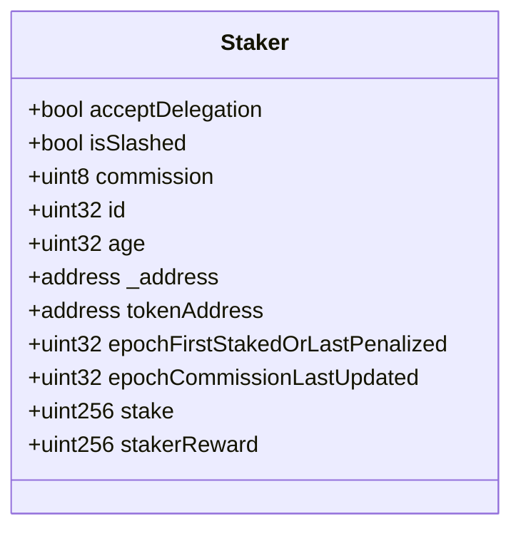
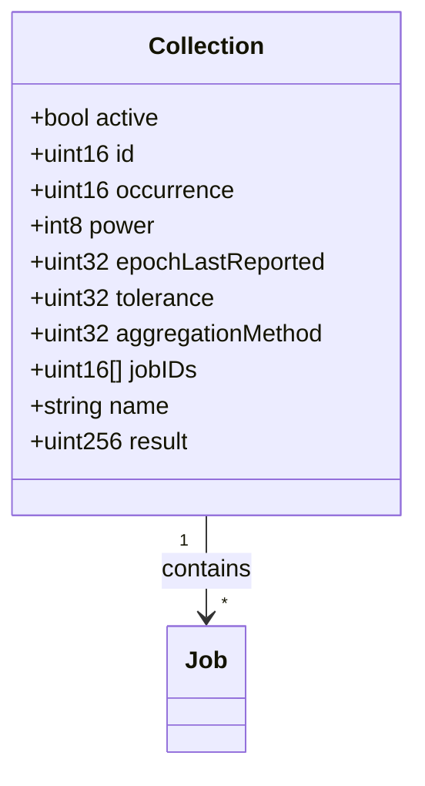
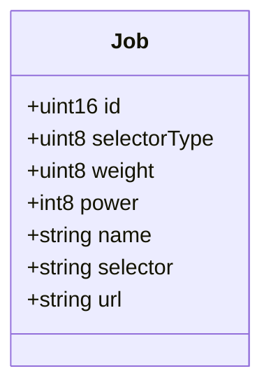
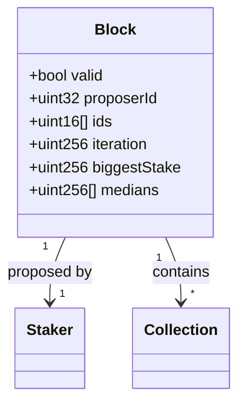
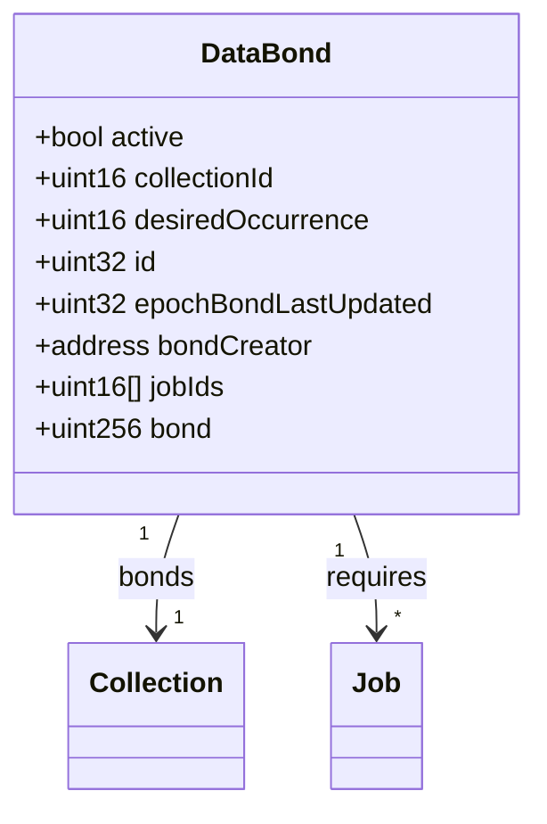
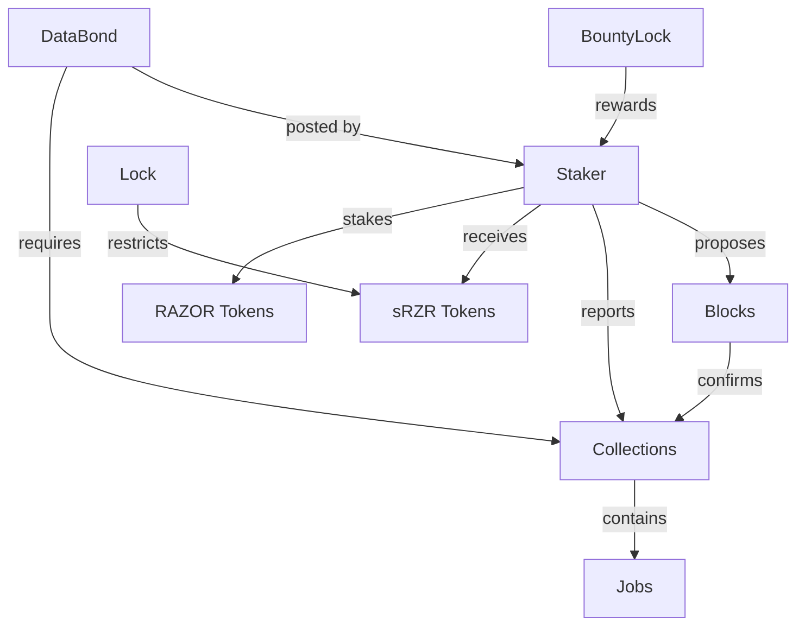
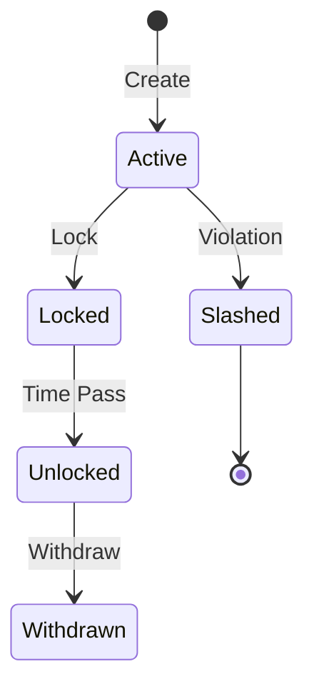

# Data Models

This document describes the core data structures and their relationships in the Oracle Contracts system.

## Core Data Structures

### Staker
Represents a participant in the oracle network who stakes RAZOR tokens.

```solidity
struct Staker {
    bool acceptDelegation;      // Whether staker accepts delegation
    bool isSlashed;            // If staker has been slashed
    uint8 commission;          // Commission rate for delegators (0-100)
    uint32 id;                // Unique identifier
    uint32 age;               // Staker's age in the system
    address _address;         // Staker's address
    address tokenAddress;     // sRZR token contract address
    uint32 epochFirstStakedOrLastPenalized;  // Tracking epoch
    uint32 epochCommissionLastUpdated;       // Last commission update
    uint256 stake;           // Total staked amount
    uint256 stakerReward;    // Accumulated rewards
}
```



### Collection
Represents a group of related data sources that need to be reported.

```solidity
struct Collection {
    bool active;              // Collection status
    uint16 id;               // Unique identifier
    uint16 occurrence;       // Reporting frequency
    int8 power;             // Decimal adjustment
    uint32 epochLastReported; // Last report epoch
    uint32 tolerance;        // Allowed deviation %
    uint32 aggregationMethod; // How to aggregate values
    uint16[] jobIDs;         // Associated jobs
    string name;             // Collection name
    uint256 result;          // Latest result
}
```



### Job
Represents a single data source that needs to be queried.

```solidity
struct Job {
    uint16 id;              // Unique identifier
    uint8 selectorType;     // JSON/XHTML (0-1)
    uint8 weight;           // Weight in aggregation (1-100)
    int8 power;            // Decimal adjustment
    string name;           // Job name
    string selector;       // Data selector
    string url;           // Data source URL
}
```



### Block
Represents a confirmed block of oracle data.

```solidity
struct Block {
    bool valid;             // Block validity
    uint32 proposerId;      // Proposer's staker ID
    uint16[] ids;          // Collection IDs
    uint256 iteration;     // Block iteration
    uint256 biggestStake;  // Largest stake
    uint256[] medians;     // Median values
}
```



### DataBond
Represents a bond for data reporting commitments.

```solidity
struct DataBond {
    bool active;                 // Bond status
    uint16 collectionId;        // Associated collection
    uint16 desiredOccurrence;   // Desired reporting frequency
    uint32 id;                  // Unique identifier
    uint32 epochBondLastUpdated; // Last update epoch
    address bondCreator;        // Creator's address
    uint16[] jobIds;           // Associated jobs
    uint256 bond;              // Bond amount
}
```



### Lock
Represents locked tokens (staking/unstaking).

```solidity
struct Lock {
    uint256 amount;      // Locked amount
    uint256 unlockAfter; // Unlock epoch
}
```

### BountyLock
Represents locked bounty rewards.

```solidity
struct BountyLock {
    uint32 redeemAfter;   // Redemption epoch
    address bountyHunter; // Hunter's address
    uint256 amount;       // Bounty amount
}
```

## Data Relationships



## Storage Layout

### Staker Storage
- Mapping of addresses to staker IDs
- Mapping of IDs to staker structs
- Total number of stakers
- Maturity levels array

### Collection Storage
- Mapping of IDs to collection structs
- Mapping of names to collection IDs
- Active collections array
- Total number of collections

### Block Storage
- Mapping of epochs to blocks
- Current epoch
- Block confirmation status

### Lock Storage
- Mapping of (address, token, type) to locks
- Mapping of IDs to bounty locks
- Counter for bounty IDs

## State Transitions



## Related Documentation
- [Architecture Overview](architecture.md)
- [API Reference](api-reference.md)
- [Core Concepts](core-concepts.md)