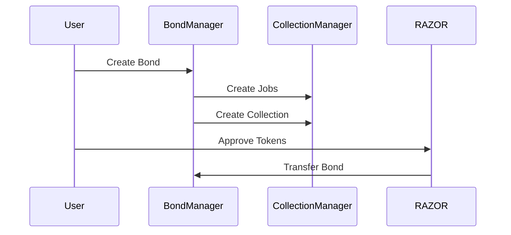
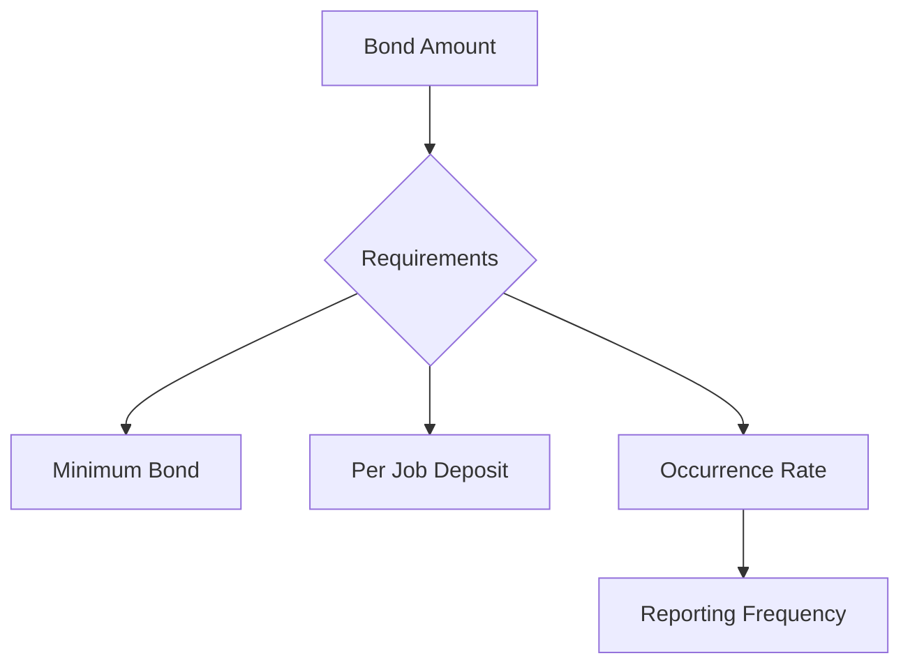

# Data Bonds Guide

This guide explains how to create and manage data bonds in the Oracle Network.

## Overview

Data bonds are a mechanism for ensuring reliable data reporting by requiring bond creators to lock RAZOR tokens as collateral. Bonds are associated with collections of data sources (jobs) and their reporting frequency.

## Bond Creation Process

### 1. Prerequisites

Before creating a data bond:
- Have sufficient RAZOR tokens
- Plan your data sources
- Understand reporting requirements
- Calculate minimum bond

### 2. Creating a Bond

```solidity
function createBond(
    uint32 epoch,
    Structs.Job[] memory mulJobs,
    uint256 bond,
    uint16 occurrence,
    int8 collectionPower,
    uint32 collectionTolerance,
    uint32 collectionAggregation,
    string calldata collectionName
)
```

Key parameters:
- `mulJobs`: Array of data source jobs
- `bond`: Amount of RAZOR to lock
- `occurrence`: Reporting frequency
- `collectionPower`: Decimal adjustment
- `collectionTolerance`: Allowed deviation
- `collectionAggregation`: Aggregation method



## Bond Management

### 1. Updating Jobs

```solidity
function updateDataBondJob(
    uint32 bondId,
    uint8 jobIndex,
    uint8 weight,
    int8 power,
    JobSelectorType selectorType,
    string calldata selector,
    string calldata url
)
```

When to update:
- Data source changes
- Weight adjustments
- Selector modifications
- URL updates

### 2. Updating Collections

```solidity
function updateDataBondCollection(
    uint32 bondId,
    uint16 collectionId,
    uint16 desiredOccurrence,
    uint32 tolerance,
    uint32 aggregationMethod,
    int8 power,
    uint16[] memory jobIds
)
```

Collection updates for:
- Frequency changes
- Tolerance adjustments
- Aggregation modifications
- Job reorganization

### 3. Adding Jobs

```solidity
function addJobsToCollection(
    uint32 bondId,
    Structs.Job[] memory jobs,
    uint16 desiredOccurrence,
    int8 collectionPower,
    uint32 collectionTolerance,
    uint32 collectionAggregation
)
```

Considerations:
- Maximum job limit
- Bond requirements
- Reporting frequency
- Collection parameters

## Bond Economics

### 1. Bond Requirements



Calculations:
- Minimum bond amount
- Deposit per job
- Occurrence limitations
- Total requirements

### 2. Adding More Bond

```solidity
function addBond(
    uint32 bondId,
    uint256 bond,
    uint16 desiredOccurrence
)
```

When to add:
- Increase frequency
- Add more jobs
- Enhance security
- Meet requirements

### 3. Unstaking Bond

```solidity
function unstakeBond(uint32 bondId, uint256 bond)
```

Process:
1. Initiate unstake
2. Wait lock period
3. Withdraw funds
4. Maintain minimums

## Bond Status Management

### 1. Setting Status

```solidity
function setDatabondStatus(bool databondStatus, uint16 bondId)
```

Status options:
- Active: Collection reporting
- Inactive: Reporting paused
- Requirements: Minimum bond

### 2. Monitoring

Track:
- Collection status
- Reporting frequency
- Bond amounts
- Job performance

## Advanced Topics

### 1. Bond Optimization

Strategies for:
- Efficient job selection
- Frequency optimization
- Bond amount balancing
- Cost management

### 2. Security Considerations

Protection against:
- Data manipulation
- Economic attacks
- Technical failures
- Market conditions

### 3. Performance Monitoring

Monitor:
- Reporting accuracy
- Collection health
- Bond efficiency
- Economic metrics

## Troubleshooting

### Common Issues

1. **Creation Problems**
   - Insufficient bond
   - Invalid jobs
   - Wrong parameters
   - Gas issues

2. **Update Failures**
   - Timing restrictions
   - Invalid changes
   - Permission issues
   - Bond requirements

3. **Withdrawal Issues**
   - Lock period
   - Minimum requirements
   - Status conflicts
   - Technical errors

## Best Practices

### 1. Bond Creation
- Start with test amounts
- Verify data sources
- Check requirements
- Monitor performance

### 2. Management
- Regular updates
- Proactive monitoring
- Economic optimization
- Risk management

### 3. Withdrawal Strategy
- Plan ahead
- Maintain minimums
- Consider timing
- Monitor locks

## Tools and Resources

### 1. Calculation Tools
- Bond requirements
- Occurrence rates
- Economic projections
- Gas estimates

### 2. Monitoring Tools
- Collection status
- Reporting metrics
- Bond efficiency
- Performance analytics

## Related Documentation
- [Core Concepts](../core-concepts.md)
- [API Reference](../api-reference.md)
- [Architecture](../architecture.md)
- [Staking Guide](staking.md)