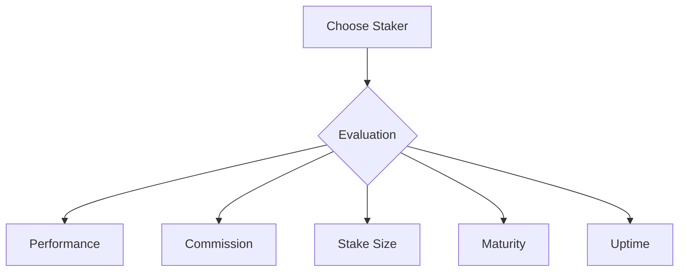
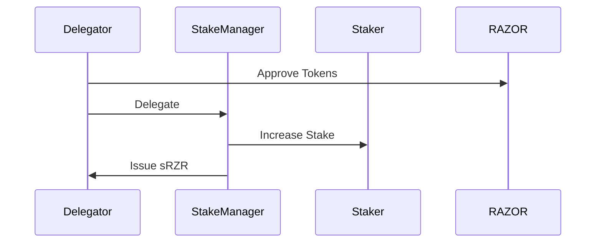
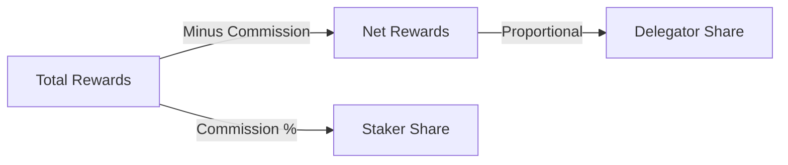
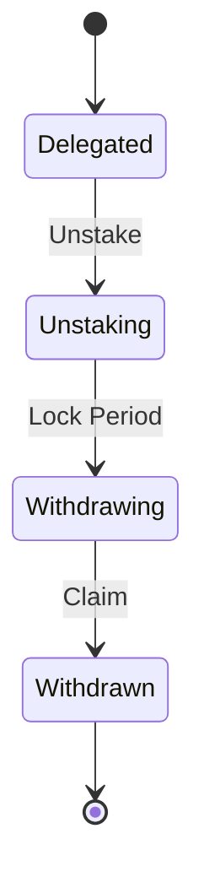

# Delegation Guide

This guide explains how to participate in the Oracle Network through delegation.

## Overview

Delegation allows users to participate in the network without running a node by delegating their RAZOR tokens to active stakers. Delegators earn rewards while stakers manage the operational aspects.

## Delegation Process

### 1. Prerequisites

Before delegating:
- Have RAZOR tokens
- Research stakers
- Understand commission rates
- Consider lock periods

### 2. Choosing a Staker

Factors to consider:
- Performance history
- Commission rate
- Total stake
- Age/maturity
- Uptime record



### 3. Delegating Tokens

```solidity
function delegate(uint32 stakerId, uint256 amount)
```

Process:
1. Approve RAZOR tokens
2. Select staker
3. Specify amount
4. Execute delegation



## Reward System

### 1. Reward Distribution

How rewards work:
- Staker earns rewards
- Commission deducted
- Remainder distributed
- Based on delegation share

### 2. Commission Structure

Understanding fees:
- Base commission rate
- Maximum limits
- Update frequency
- Calculation method



## Managing Delegation

### 1. Monitoring Performance

Track:
- Reward earnings
- Staker performance
- Network participation
- Commission changes

### 2. Unstaking Process

```solidity
function unstake(uint32 stakerId, uint256 sAmount)
```

Steps:
1. Initiate unstake
2. Wait lock period
3. Initiate withdrawal
4. Complete withdrawal



## Risk Management

### 1. Staker Risks

Potential issues:
- Poor performance
- Commission changes
- Slashing events
- Inactivity

### 2. Network Risks

Consider:
- Market conditions
- Protocol changes
- Technical issues
- Economic factors

### 3. Mitigation Strategies

Best practices:
- Diversify delegations
- Monitor actively
- Plan exit strategy
- Stay informed

## Advanced Topics

### 1. Delegation Strategy

Optimization:
- Timing entries
- Size management
- Staker selection
- Exit planning

### 2. Reward Optimization

Maximizing returns:
- Commission comparison
- Performance tracking
- Compound strategy
- Tax efficiency

### 3. Portfolio Management

Balancing:
- Risk levels
- Return targets
- Lock periods
- Liquidity needs

## Troubleshooting

### Common Issues

1. **Delegation Problems**
   - Insufficient balance
   - Staker not accepting
   - Wrong parameters
   - Technical issues

2. **Reward Issues**
   - Distribution delays
   - Calculation errors
   - Commission changes
   - Network issues

3. **Withdrawal Problems**
   - Lock periods
   - Gas costs
   - Timing issues
   - Technical errors

## Best Practices

### 1. Due Diligence
- Research stakers
- Check history
- Verify commission
- Monitor performance

### 2. Risk Management
- Start small
- Diversify
- Monitor regularly
- Plan exits

### 3. Record Keeping
- Track delegations
- Monitor rewards
- Document changes
- Tax implications

## Tools and Resources

### 1. Analysis Tools
- Staker metrics
- Performance tracking
- Reward calculator
- Risk assessment

### 2. Monitoring Tools
- Network status
- Staker performance
- Reward tracking
- Commission changes

## Related Documentation
- [Core Concepts](../core-concepts.md)
- [API Reference](../api-reference.md)
- [Architecture](../architecture.md)
- [Staking Guide](staking.md)