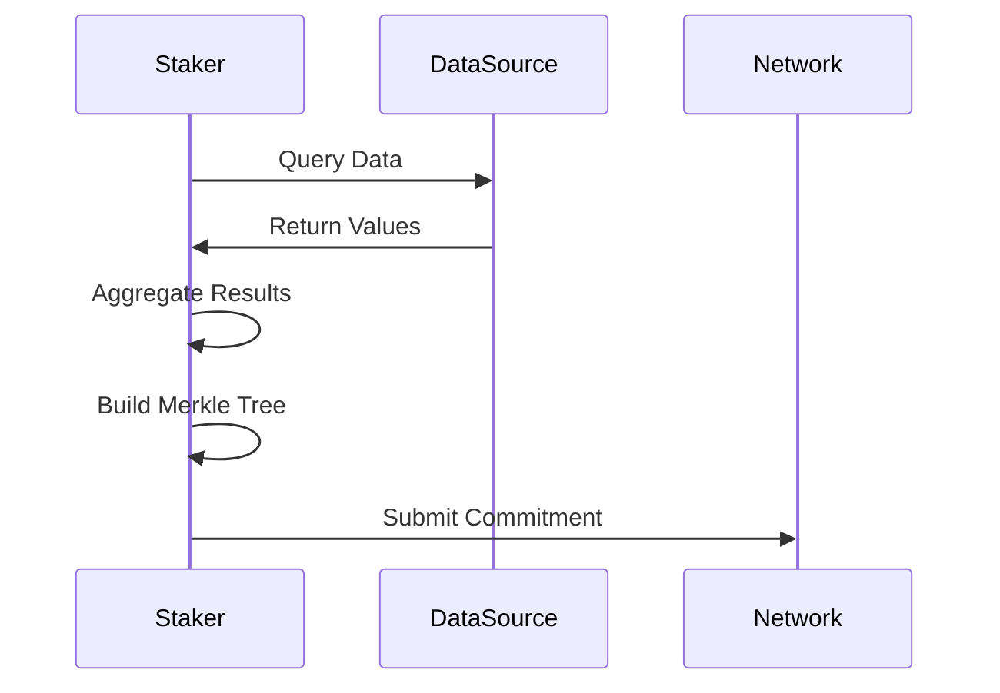
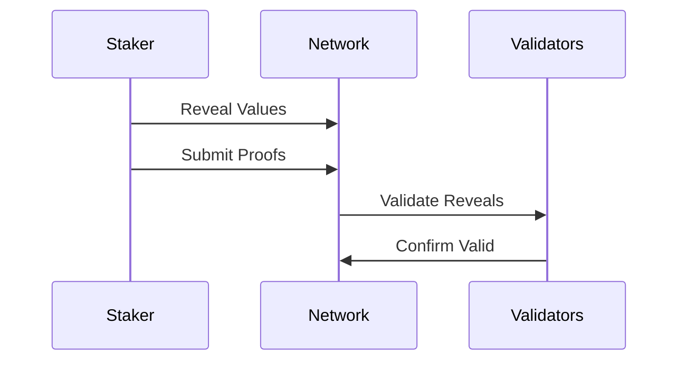
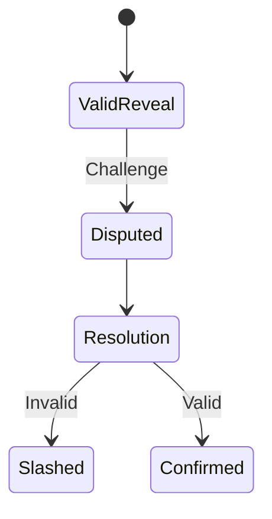

# Voting Guide

This guide explains how to participate in the Oracle Network's consensus process through voting.

## Overview

The Oracle Network uses a commit-reveal voting scheme to ensure fair and tamper-resistant data reporting. Stakers participate in multiple phases:
1. Commit Phase - Submit encrypted votes
2. Reveal Phase - Reveal actual values
3. Dispute Phase - Challenge incorrect values
4. Resolution Phase - Finalize results

## Voting Process

### 1. Commit Phase

During the commit phase, stakers:
1. Query assigned data sources
2. Aggregate results
3. Create a Merkle tree of values
4. Submit the Merkle root as commitment



#### Creating a Commitment
```solidity
struct Commitment {
    uint32 epoch;
    bytes32 commitmentHash;
}
```

Key considerations:
- Use secure random salt
- Include all assigned collections
- Meet depth requirements
- Submit within timeframe

### 2. Reveal Phase

During the reveal phase, stakers:
1. Reveal original values
2. Provide Merkle proofs
3. Validate other reveals
4. Build consensus



#### Vote Weight Calculation
Vote weight depends on:
- Staker's influence (stake × maturity)
- Accuracy history
- Participation rate
- Value deviation

### 3. Dispute Phase

Disputes can be raised when:
- Values deviate significantly
- Proofs are invalid
- Rules are violated



#### Dispute Resolution
1. Challenge submission
2. Evidence verification
3. Stake implications
4. Result adjustment

### 4. Finalization

Results are finalized when:
1. Sufficient votes received
2. Consensus achieved
3. Dispute period passed
4. Block confirmed

## Best Practices

### 1. Data Collection
- Use reliable data sources
- Implement proper error handling
- Validate input data
- Handle edge cases

### 2. Vote Submission
- Meet timing requirements
- Verify commitments
- Double-check values
- Monitor gas costs

### 3. Security
- Secure salt generation
- Safe key management
- Network monitoring
- Backup procedures

## Advanced Topics

### 1. Influence Optimization
- Maintain high uptime
- Build maturity
- Avoid slashing
- Strategic staking

### 2. Merkle Tree Management
```solidity
struct MerkleTree {
    AssignedAsset[] values;
    bytes32[][] proofs;
    bytes32 root;
}
```

Key aspects:
- Proper construction
- Proof verification
- Tree balancing
- Depth requirements

### 3. Dispute Strategies
When to dispute:
- Clear violations
- Significant deviations
- Provable cases
- Economic viability

## Error Handling

### Common Issues

1. **Failed Commits**
   - Invalid format
   - Wrong timing
   - Gas issues
   - Tree depth mismatch

2. **Failed Reveals**
   - Invalid proofs
   - Wrong values
   - Timing issues
   - Gas limitations

3. **Dispute Problems**
   - Insufficient evidence
   - Wrong procedure
   - Timing constraints
   - Economic factors

## Monitoring and Analytics

### 1. Performance Metrics
- Vote success rate
- Dispute involvement
- Consensus participation
- Reward efficiency

### 2. Network Statistics
- Total influence
- Vote distribution
- Value convergence
- Dispute frequency

### 3. Economic Analysis
- Reward projections
- Slashing risk
- Gas optimization
- ROI calculations

## Tools and Resources

### 1. Development Tools
- Test networks
- Simulation tools
- Monitoring systems
- Analytics platforms

### 2. Reference Materials
- Technical specifications
- API documentation
- Example implementations
- Best practices

## Related Documentation
- [Core Concepts](../core-concepts.md)
- [API Reference](../api-reference.md)
- [Architecture](../architecture.md)
- [Staking Guide](staking.md)